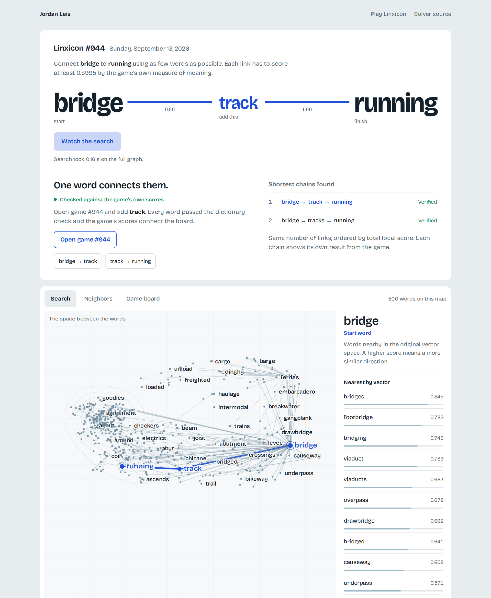
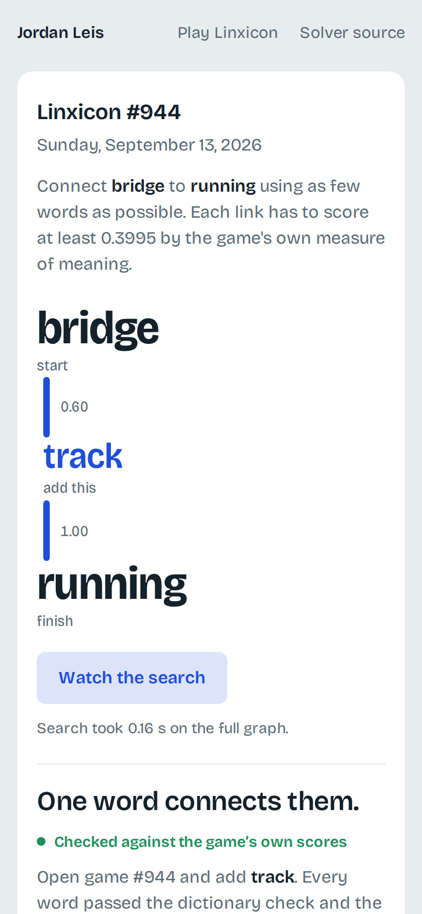

# Linxicon Optimal Solver

Solves the daily [Linxicon](https://linxicon.com/) word-chain puzzle: the shortest chain of words from one starter to the other, using the game's own scoring (ConceptNet Numberbatch vectors plus WordNet boosts), checked against the game's server before it is shown.

## See today's solve

**[jordanleis.com/linxicon-solver](https://jordanleis.com/linxicon-solver/)** shows today's puzzle as a route. Reveal the chain, watch the search spread across a map of 500 words, or inspect why any two words connect. It updates itself every hour from this repository.

[](https://jordanleis.com/linxicon-solver/)



## Run it yourself

Python 3.12. Setup downloads the ENABLE dictionary, the 325 MB Numberbatch archive and the WordNet corpus, then builds the vector and graph caches (about 30 seconds, no GPU).

```bash
python3 -m venv .venv && source .venv/bin/activate
python -m pip install -r requirements.txt
python scripts/setup_data.py

python -m linxicon_solver --today --verify   # today's puzzle, checked against the game
python -m linxicon_solver chest setting      # any pair of words, fully offline
```

The output lists each chain with its link scores; enter only the words between the two starters, in order. All options are in [docs/cli.md](docs/cli.md).

## How it works

Each word is a Numberbatch vector; a link's score is `max(0, cosine)`, raised to 1.0 for words sharing a WordNet synset and 0.6 for direct hypernym/hyponym pairs, matching the game's measured behaviour. Links at or above 0.3995 form a graph of about 51,000 words; breadth-first search finds every shortest chain and ranks equal-length chains by total score. With `--verify`, each candidate's words are validated on the server and the board is replayed with the server's own pair scores under the game's top-five link rule. Details and known limits are in [docs/scoring.md](docs/scoring.md).

## More

- [docs/cli.md](docs/cli.md): every option, exit codes and verification behaviour
- [docs/scoring.md](docs/scoring.md): scoring model, limits, caches and recorded results
- [docs/atlas-export.md](docs/atlas-export.md): the daily export and the graph bundle that feed the website
- `python -m pytest tests/ -q` runs the suite without touching the game server
